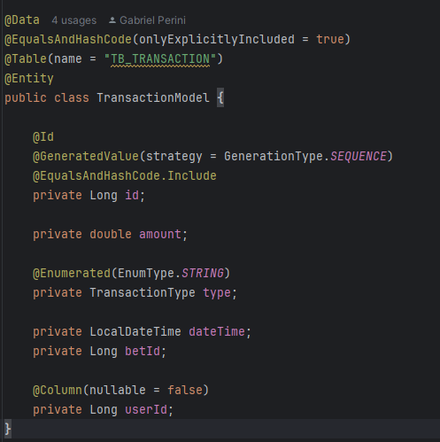

# SSRP - Single Responsabilty Principle

## Contexto
 Uma classe deve ter um, e somente um, motivo para mudar.

Esse princípio declara que uma classe deve ser especializada em um único assunto e possuir apenas uma responsabilidade dentro do software, ou seja, a classe deve ter uma única tarefa ou ação para executar.

## Use Cases

### Titulo

Por conta do uso da Arquitetura Hexagonal, que preza pelo desacomplamento do código do domínio, isolando-o das demais dependências da aplicação temos o cenário acima
