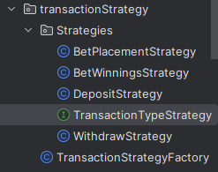
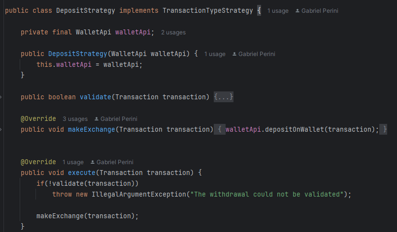

# OCP - Open Closed Principle

## Contexto
 Objetos ou entidades devem estar abertos para extensão, porém fechados para modificação.

De forma simples, devemos ser capazes de estender uma classe e criar novos comportamentos sem precisar modificá-la por dentro. Independente do estilo arquitetural que seguimos, este é um princípio que nos permite adicionar novas funcionalidades e regras evitando ao máximo quebrar aquelas já existentes. Alguns padrões como o strategy e o decorator nos dão suporte para execução deste princípio de forma eficiente.

## Use Cases

### Titulo

Aqui a interface define um contrato de comportamento padrão e permite que esse comportamento seja alterado de acordo com cada classe que herda esses comportamentos.
