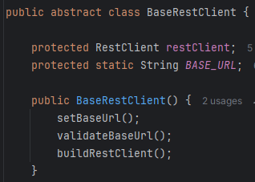

# LLSP - Liskov Substitution Principle

## Contexto
As classes derivadas devem ser substituídas pelas suas classes base.
O LSP basicamente defende que uma subclasse deve sobrescrever os métodos da superclasse de forma que a funcionalidade do ponto de vista do cliente continue a mesma.

## Use Cases

### TransactionStrategy

Existem poucas instâncias do uso de classes abstratas durante a implmentação, em contra partida há inúmeras interfaces. Acreditamos que o exemplo mais claro do LSP se encontra no cenário de TransactionStrategy. Como existem vários tipos de transações, com validações e ações diferentes na carteira do usuário se sentiu a necessidade do padrão de projeto.

Acima temos uma das estratégias, cada um pode seguir um fluxo diferente, necessitando validar e fazer a troca de dinheiro em momentos específicos.

Mas de qualquer maneira elas são parte da regra de negócio, então seu cliente é o próprio transactionService que depende do funcionamento de seus métodos independentemente do tipo de transação.

Ao criar uma transação

Ou só validando-a em outro microserviço

---

### BaseRestClient

Fazemos uso de classes abstratas, mas é apenas para assegurar o comportamento de suas classes filhas

