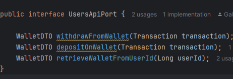
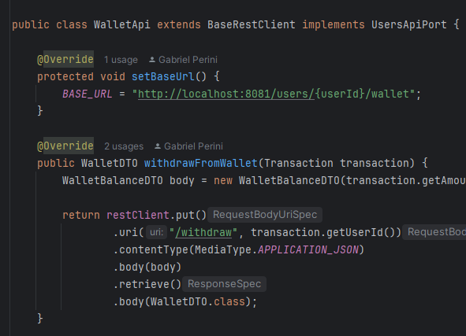
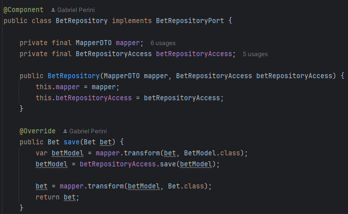
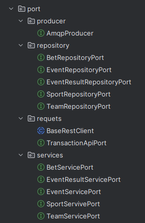

# IISP - Interface Segregation Principle

## Contexto
Uma classe não deve ser forçada a implementar interfaces e métodos que não irão utilizar.

Esse princípio basicamente diz que é melhor criar interfaces mais específicas ao invés de termos uma única interface genérica.

## Use Cases

Como mencionado no SPR o uso das arquiteturas escolhinhas Arquitetura Hexagonal dita muito de como implemtanmos os microserviços, mas apesar da abundância de interfaces não temos um caso específico de uma classe impletando várias delas...

### RestClient + ModelApiPort

O exemplo mais claro é o uso do método setBaseUrl, qué um método abstrato da classe BaseRestClient em conjunto com qualquer port para APIs de outros serviços.

Aqui temos um exemplo de um port criado para orientar a criação das rotas e APIs de ms-transactions com ms-users

Como resultado temos a walletAPI, que precisa implementar tanto o método para setar a URL padrao quanto os métodos que definem seu comportamento de UsersApiPort (o nome deveria ser wallet hehe).

### JPARepository + RepositoryPort

Esse exemplo se encaixa mais em uma definição de composição do que o ISP em si, mas achei interessante citar. 
RepositoryPort define o comportamento e ajuda a desacoplar a camada de acesso aos dados da camada de domínio, mas o JpaRepository já é um interface. A solução foi usá-lo como componente nos casos necessários.

### Ports and Adapters

Existem várias portas (interfaces) no sistema para evitar o acoplamento como dito anteriormente.

