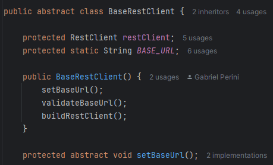

# IISP - Interface Segregation Principle

## Contexto
Uma classe não deve ser forçada a implementar interfaces e métodos que não irão utilizar.

Esse princípio basicamente diz que é melhor criar interfaces mais específicas ao invés de termos uma única interface genérica.

## Use Cases

Como mencionado no SPR o uso das arquiteturas escolhinhas Arquitetura Hexagonal dita muito de como implemtanmos os microserviços, mas apesar da abundância de interfaces não temos um caso específico de uma classe impletando várias delas...

### RestClient + ModelApiPort

O exemplo mais claro é o uso do método setBaseUrl, qué um método abstrato da classe BaseRestClient em conjunto com qualquer port para APIs de outros serviços.

