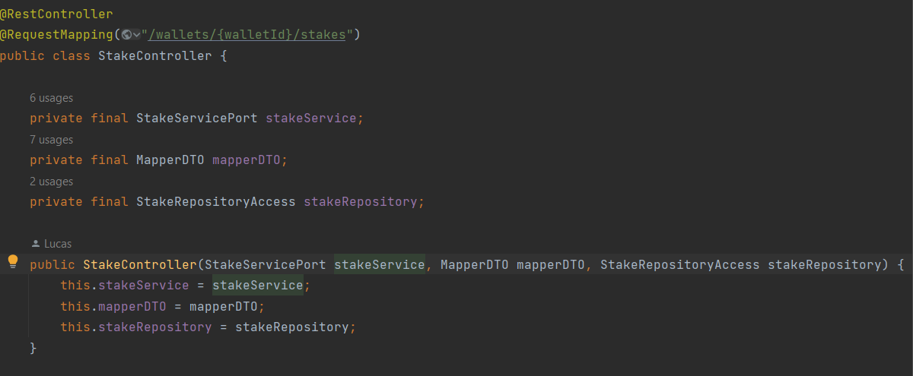
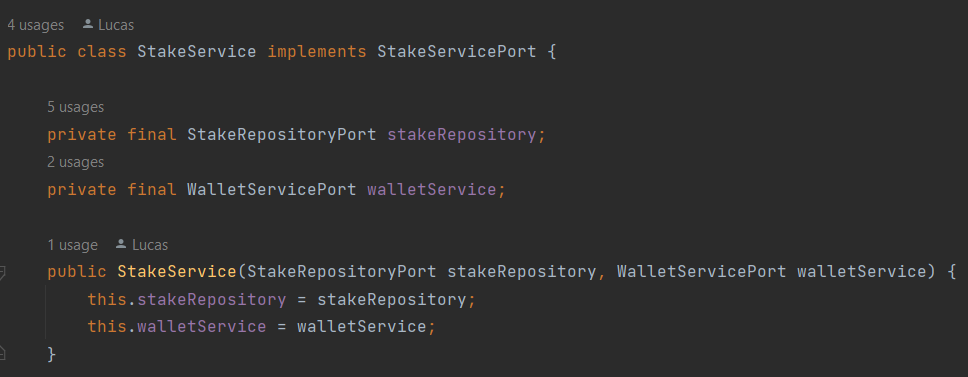

# DIP - Dependency Inversion Principle

## Contexto
 Entidades devem depender de classes abstratas ou interfaces, não de implementações concretas.

Nas nossas estruturas a comunicação entre os módulos é sempre feita por meio de interfaces, para que haja o mínimo de acoplamento possível. A lógica de negócio que é o foco central da arquitetura não se importa ou conhece com detalhes externos, como o acesso a APIs terceiras, conexão com banco de dados ou gerenciamento de ORMs, etc.

## Use Cases

### Titulo

Aqui podemos ver que a comunicação é feita por meio de interfaces, com isso é possível depender delas e alterar quando for necessário. 
